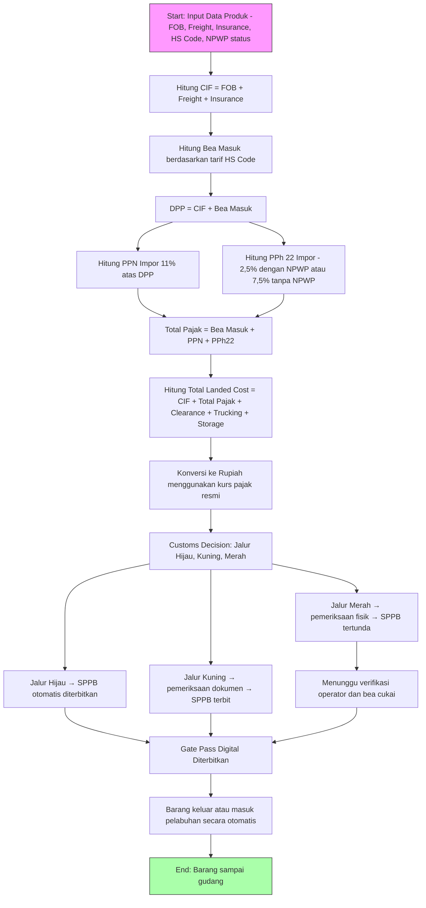

# 📦 Sistem Otomatisasi Perpajakan & Bea Cukai

Dokumen ini menjelaskan **alur sistem otomatisasi perpajakan dan bea cukai** untuk impor barang, termasuk **perhitungan bea masuk & pajak impor** sesuai panduan [Uniair Cargo](https://www.uniaircargo.co.id/blog/bea-cukai/cara-menghitung-bea-masuk-pajak-impor), serta **flowchart dalam Mermaid.js**.

---

## 🔹 1. Alur Bea Cukai (Customs Flow)

Dalam sistem GATEGO (simulasi digital pelabuhan):

1. **PIB (Pemberitahuan Impor Barang) Submitted**  
   Importir melaporkan barang lewat dokumen PIB.

2. **Payment Processed**  
   Sistem memproses pembayaran pajak impor (bea masuk, PPN, PPh 22).

3. **Customs Response → Jalur Pemeriksaan**  
   - **Jalur Hijau** → barang umum/bahan pokok → langsung keluar, **SPPB otomatis terbit**.  
   - **Jalur Kuning** → barang rawan sedang (contoh: minyak) → butuh pemeriksaan dokumen tambahan.  
   - **Jalur Merah** → barang rawan tinggi (contoh: barang mewah, senjata) → wajib pemeriksaan fisik → **SPPB tertunda**.

4. **SPPB (Surat Persetujuan Pengeluaran Barang)**  
   Dokumen resmi dari Bea Cukai yang wajib ada sebelum barang keluar.

5. **Gate Pass Digital**  
   Setelah SPPB valid → sistem menerbitkan **QR Code Gate Pass** → armada bisa masuk/keluar pelabuhan otomatis.

---

## 🔹 2. Alur Perhitungan Pajak Impor

Perhitungan berdasarkan **metode resmi Bea Cukai (Uniair Cargo)**.

### 🧾 Komponen Biaya Impor
- **FOB** (Free on Board): harga barang tanpa ongkir & asuransi.  
- **Freight**: ongkos kirim barang.  
- **Insurance**: premi asuransi barang.  

### 📊 Rumus Perhitungan

1. **CIF (Cost, Insurance, Freight)**
   ```
   CIF = FOB + Freight + Insurance
   ```

2. **Bea Masuk**
   ```
   Bea Masuk = CIF × Tarif Bea Masuk (berdasarkan HS Code)
   ```

3. **DPP (Dasar Pengenaan Pajak)**
   ```
   DPP = CIF + Bea Masuk
   ```

4. **PPN Impor (11%)**
   ```
   PPN = DPP × 11%
   ```

5. **PPh Pasal 22 Impor**
   - Jika punya NPWP → 2,5% × DPP  
   - Jika tanpa NPWP → 7,5% × DPP  

6. **Total Pajak Impor**
   ```
   Total Pajak = Bea Masuk + PPN + PPh 22
   ```

7. **Total Landed Cost**
   ```
   Landed Cost = CIF + Total Pajak + Clearance + Trucking + Storage + Pemeriksaan
   ```

8. **Konversi ke Rupiah**
   ```
   Landed Cost (IDR) = Landed Cost (USD) × Kurs Pajak Resmi
   ```

---

## 🔹 3. Contoh Perhitungan

Misal data sebagai berikut:
- FOB: **$5.000**
- Freight: **$500**
- Insurance: **$50**
- Tarif Bea Masuk: **5%**
- NPWP: **Ada**
- Kurs Pajak: **Rp16.000**
- Biaya tambahan (clearance, trucking, storage): **$325**

### Perhitungan:
1. CIF = 5000 + 500 + 50 = **$5.550**  
2. Bea Masuk = 5.550 × 5% = **$277,50**  
3. DPP = 5.550 + 277,50 = **$5.827,50**  
4. PPN = 5.827,50 × 11% ≈ **$641,03**  
5. PPh 22 = 5.827,50 × 2,5% ≈ **$145,69**  
6. Total Pajak = 277,50 + 641,03 + 145,69 = **$1.064,21**  
7. Landed Cost (USD) = 5.550 + 1.064,21 + 325 = **$6.939,21**  
8. Landed Cost (IDR) = 6.939,21 × 16.000 ≈ **Rp111.027.360**

---

## 🔹 4. Flowchart Sistem Otomatisasi (Mermaid.js)

Berikut flow sistem otomatisasi perpajakan & bea cukai:



---

## 📌 Kesimpulan

- Sistem otomatisasi ini menggabungkan **perhitungan pajak impor** dengan **alur clearance Bea Cukai**.  
- Semua perhitungan dilakukan otomatis sesuai kurs pajak resmi.  
- Integrasi digital (OCR, barcode, QR Gate Pass) memastikan barang hanya keluar jika **SPPB valid**.  
- Jalur **Hijau, Kuning, Merah** menentukan tingkat pemeriksaan sebelum barang bisa keluar pelabuhan.  
