# 📦 Sistem Otomatisasi Perpajakan & Bea Cukai

Dokumen ini menjelaskan **alur sistem otomatisasi perpajakan dan bea cukai** untuk impor barang, termasuk **perhitungan bea masuk & pajak impor** sesuai panduan [Uniair Cargo](https://www.uniaircargo.co.id/blog/bea-cukai/cara-menghitung-bea-masuk-pajak-impor), serta **flowchart dalam Mermaid.js**.

---

## 🔹 1. Alur Bea Cukai (Customs Flow)

Dalam sistem GATEGO (simulasi digital pelabuhan):

1. **PIB (Pemberitahuan Impor Barang) Submitted**  
   Importir melaporkan barang lewat dokumen PIB.

2. **Payment Processed**  
   Sistem memproses pembayaran pajak impor (bea masuk, PPN, PPh 22).

3. **Customs Response → Jalur Pemeriksaan**  
   - **Jalur Hijau** → barang umum/bahan pokok → langsung keluar, **SPPB otomatis terbit**.  
   - **Jalur Kuning** → barang rawan sedang (contoh: minyak) → butuh pemeriksaan dokumen tambahan.  
   - **Jalur Merah** → barang rawan tinggi (contoh: barang mewah, senjata) → wajib pemeriksaan fisik → **SPPB tertunda**.

4. **SPPB (Surat Persetujuan Pengeluaran Barang)**  
   Dokumen resmi dari Bea Cukai yang wajib ada sebelum barang keluar.

5. **Gate Pass Digital**  
   Setelah SPPB valid → sistem menerbitkan **QR Code Gate Pass** → armada bisa masuk/keluar pelabuhan otomatis.

---

## 🔹 2. Alur Perhitungan Pajak Impor

Perhitungan berdasarkan **metode resmi Bea Cukai (Uniair Cargo)**.

### 🧾 Komponen Biaya Impor
- **FOB** (Free on Board): harga barang tanpa ongkir & asuransi.  
- **Freight**: ongkos kirim barang.  
- **Insurance**: premi asuransi barang.  

### 📊 Rumus Perhitungan

1. **CIF (Cost, Insurance, Freight)**
   ```
   CIF = FOB + Freight + Insurance
   ```

2. **Bea Masuk**
   ```
   Bea Masuk = CIF × Tarif Bea Masuk (berdasarkan HS Code)
   ```

3. **DPP (Dasar Pengenaan Pajak)**
   ```
   DPP = CIF + Bea Masuk
   ```

4. **PPN Impor (11%)**
   ```
   PPN = DPP × 11%
   ```

5. **PPh Pasal 22 Impor**
   - Jika punya NPWP → 2,5% × DPP  
   - Jika tanpa NPWP → 7,5% × DPP  

6. **Total Pajak Impor**
   ```
   Total Pajak = Bea Masuk + PPN + PPh 22
   ```

7. **Total Landed Cost**
   ```
   Landed Cost = CIF + Total Pajak + Clearance + Trucking + Storage + Pemeriksaan
   ```

8. **Konversi ke Rupiah**
   ```
   Landed Cost (IDR) = Landed Cost (USD) × Kurs Pajak Resmi
   ```

---

## 🔹 3. Contoh Perhitungan

Misal data sebagai berikut:
- FOB: **$5.000**
- Freight: **$500**
- Insurance: **$50**
- Tarif Bea Masuk: **5%**
- NPWP: **Ada**
- Kurs Pajak: **Rp16.000**
- Biaya tambahan (clearance, trucking, storage): **$325**

### Perhitungan:
1. CIF = 5000 + 500 + 50 = **$5.550**  
2. Bea Masuk = 5.550 × 5% = **$277,50**  
3. DPP = 5.550 + 277,50 = **$5.827,50**  
4. PPN = 5.827,50 × 11% ≈ **$641,03**  
5. PPh 22 = 5.827,50 × 2,5% ≈ **$145,69**  
6. Total Pajak = 277,50 + 641,03 + 145,69 = **$1.064,21**  
7. Landed Cost (USD) = 5.550 + 1.064,21 + 325 = **$6.939,21**  
8. Landed Cost (IDR) = 6.939,21 × 16.000 ≈ **Rp111.027.360**

---

## 🔹 4. Flowchart Sistem Otomatisasi (Mermaid.js)

Berikut flow sistem otomatisasi perpajakan & bea cukai:

```mermaid
flowchart TD
    A[Start: Input Data Produk - FOB, Freight, Insurance, HS Code, NPWP status] --> B[Hitung CIF = FOB + Freight + Insurance]
    B --> C[Hitung Bea Masuk berdasarkan tarif HS Code]
    C --> D[DPP = CIF + Bea Masuk]
    D --> E[Hitung PPN Impor 11% atas DPP]
    D --> F[Hitung PPh 22 Impor - 2,5% dengan NPWP atau 7,5% tanpa NPWP]
    E --> G[Total Pajak = Bea Masuk + PPN + PPh22]
    F --> G
    G --> H[Hitung Total Landed Cost = CIF + Total Pajak + Clearance + Trucking + Storage]
    H --> I[Konversi ke Rupiah menggunakan kurs pajak resmi]
    I --> J[Customs Decision: Jalur Hijau, Kuning, Merah]
    J --> K[Jalur Hijau → SPPB otomatis diterbitkan]
    J --> L[Jalur Kuning → pemeriksaan dokumen → SPPB terbit]
    J --> M[Jalur Merah → pemeriksaan fisik → SPPB tertunda]
    K --> N[Gate Pass Digital Diterbitkan]
    L --> N
    M --> O[Menunggu verifikasi operator dan bea cukai]
    O --> N
    N --> P[Barang keluar atau masuk pelabuhan secara otomatis]
    P --> Q[End: Barang sampai gudang]

    style A fill:#f9f,stroke:#333,stroke-width:1px
    style Q fill:#afa,stroke:#333,stroke-width:1px
```



---
## 🔹 5. Flowchart kombinasi pajak beacukai dengan pelindo 

---
Konsep penyatuan alurnya:

Input Data Awal

Importir/forwarder hanya sekali input data (PIB, invoice, CIF, HS Code, detail kontainer).

Data masuk ke sistem terpusat.

Proses Bea Cukai

Sistem menghitung pajak impor (pakai rumus CIF → Bea → PPN → PPh22 → Total).

Dokumen diperiksa (jalur hijau, kuning, merah).

Status SPPB otomatis diterbitkan jika lolos.

Sinkronisasi ke Pelindo

Begitu status SPPB keluar, sistem otomatis update ke dashboard Pelindo.

Operator Pelindo langsung tahu kontainer ini sudah clear customs.

Proses Pelindo

Pelindo menjalankan layanan kepelabuhanan: stevedoring, terminal handling, storage, trucking.

Tagihan jasa langsung terhubung ke dashboard yang sama.

Gate Pass Digital

Sistem membuat barcode/QR untuk gate pass.

Validasi OCR/barcode dilakukan di gate → jika status customs & pelabuhan clear, palang terbuka.

👉 Dengan begitu, importir hanya akses satu platform dan tidak perlu input berulang.

2. Apakah Ada Rumus Khusus di Pelindo?

Pelindo tidak punya rumus perpajakan (itu ranah Bea Cukai).
Pelindo punya perhitungan tarif jasa → sifatnya biaya pelayanan, bukan pajak.

Beberapa contoh komponen biaya Pelindo:

Stevedoring = biaya bongkar muat per kontainer.

Cargodoring = biaya pemindahan barang dari dermaga ke lapangan.

Receiving/Delivery = biaya penerimaan & pengiriman kontainer.

Storage = biaya penumpukan (biasanya gratis X hari, setelah itu kena tarif per hari per TEU).

Administrasi & lain-lain = misalnya pemeriksaan, jasa tambahan (fumigasi, keamanan).

📌 Rumus sederhananya lebih ke:

Total Biaya Pelindo = (Stevedoring + Cargodoring + Receiving/Delivery) 
                    + (Storage × Lama Hari × Tarif Per Hari) 
                    + Biaya Tambahan (jika ada)

3. Konsep Mudah Dipahami untuk Umum

Kalau untuk orang awam, bisa dipahami begini:

Bea Cukai itu seperti pajak negara: bayar dulu biar barang boleh masuk.

Pelindo itu seperti biaya parkir & jasa pelabuhan: bayar karena pakai dermaga, gudang, dan alat pelabuhan.

Sistem gabungan:

Bayangkan tol + parkir dalam satu aplikasi e-toll.

Begitu bayar tol (pajak impor clear), sistem otomatis tahu kamu boleh parkir (Pelindo bisa layani barangmu).

Semua dalam satu dashboard → lebih cepat, lebih jelas, dan transparan.

⚡ Jadi ringkasnya:

Penyatuan alur: cukup dengan integrasi status Bea Cukai (SPPB) → jadi trigger untuk Pelindo.

Rumus Pelindo: tarif layanan (storage, stevedoring, cargodoring), bukan pajak.

Konsep awam: Bea Cukai = pajak, Pelindo = biaya jasa, disatukan agar proses ekspor-impor sekali jalan tanpa bolak-balik.

# Referensi Bea Cukai

Rumus-rumus pajak impor yang ada di flowchart tadi saya ambil dari sumber resmi yang relevan, salah satunya:

Artikel Uniair Cargo: Cara Menghitung Bea Masuk dan Pajak Impor 

pajak

Rumus yang dipakai Bea Cukai RI (sesuai PMK No. 34/PMK.010/2017 tentang PPN dan PPh Pasal 22 Impor):

CIF = FOB + Freight + Insurance

Bea Masuk = CIF × Tarif Bea Masuk (HS Code)

DPP = CIF + Bea Masuk

PPN = DPP × 11%

PPh 22 = DPP × 2,5% (punya NPWP) atau 7,5% (tidak punya NPWP)

Total Pajak = Bea Masuk + PPN + PPh22

Landed Cost = CIF + Pajak + biaya lain (clearance, trucking, storage)

👉 Jadi, untuk sisi Bea Cukai, rumus dan alurnya valid dan sesuai aturan resmi.

📌 2. Referensi Pelindo

Untuk alur Pelindo, rumusnya bukan pajak tapi biaya layanan kepelabuhanan, dan sifatnya memang tarif jasa.
Sumber rujukan:

Website Pelindo (Pelindo IV, Pelindo Multi Terminal, dll) tentang struktur tarif jasa kepelabuhanan.

Laporan BUMN dan dokumen tarif resmi Pelindo (misalnya Keputusan Direksi tentang Tarif Jasa Terminal).

Komponen utama yang selalu muncul:

Stevedoring = bongkar muat dari kapal ke dermaga.

Cargodoring = pemindahan dari dermaga ke lapangan penumpukan.

Receiving/Delivery = penerimaan dan pengiriman ke/dari terminal.

Storage = biaya penumpukan kontainer (biasanya gratis 3 hari, selebihnya kena tarif per TEU per hari).

Rumus sederhananya (hasil penyederhanaan):

Total Biaya Pelindo = Stevedoring + Cargodoring + Receiving/Delivery 
                    + (Storage × Lama Hari) 
                    + Biaya Tambahan (jika ada)


👉 Tarif persisnya berbeda tiap pelabuhan (Pelindo I–IV) dan tiap terminal, serta diatur lewat Peraturan Menteri Perhubungan dan SK Direksi Pelindo.
Jadi di flowchart, saya pakai bentuk konsep umum yang valid di lapangan, tapi angkanya bisa berbeda di tiap pelabuhan.

📌 3. Apakah Valid di Lapangan?

Bea Cukai → Ya, valid karena mengacu aturan pemerintah (PMK) & praktik umum importasi.

Pelindo → Ya, valid secara konsep karena memang begitu alurnya (kapal → bongkar muat → storage → gate).

Yang berbeda hanyalah tarif detail antar lokasi (Tanjung Priok, Tanjung Perak, Belawan, dll).

Tapi rumus hitungan biaya layanan = struktur baku di seluruh pelabuhan Pelindo.

📌 4. Penyatuan Alur

Di dunia nyata, sistem Bea Cukai (CEISA/DJBC) sudah terpisah dari sistem Pelindo (Inaportnet / Terminal Operating System).
Namun, bisa diintegrasikan dengan API atau integrasi data → misalnya:

Begitu Bea Cukai terbitkan SPPB, sistem Pelindo langsung update → kontainer bisa keluar lewat gate.

Jadi flowchart gabungan yang kita buat itu masuk akal dan realistis, meski implementasinya perlu koordinasi antar lembaga.
## 📌 Kesimpulan

- Sistem otomatisasi ini menggabungkan **perhitungan pajak impor** dengan **alur clearance Bea Cukai**.  
- Semua perhitungan dilakukan otomatis sesuai kurs pajak resmi.  
- Integrasi digital (OCR, barcode, QR Gate Pass) memastikan barang hanya keluar jika **SPPB valid**.  
- Jalur **Hijau, Kuning, Merah** menentukan tingkat pemeriksaan sebelum barang bisa keluar pelabuhan.  
